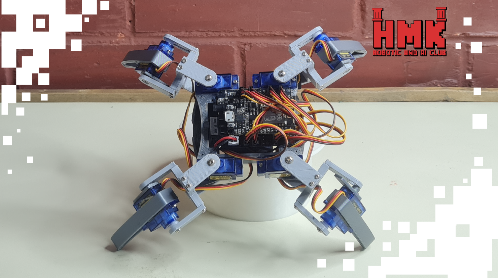

# 🕷️ QuadSpider Robot

## 📅 Project Timeline & Context

- **Event:** FMEE 2025 – **AI & Robotics Club** Open Day
- **Date:** November 10–11–12, 2025

---

## 💡 Project Overview
**QuadSpider** is a compact four-legged robotic creature designed to explore app-based motion control.  
Using eight servos, an ESP32, and a mobile app, the robot can:

- Walk forward or backward  
- Turn left or right  
- Execute preset movement sequences

 
Each of its four legs uses a dual-servo configuration, giving the robot the agility to walk, turn, and even perform predefined movement sequences—small choreographies triggered at the tap of a button.

The goal is to blend lightweight hardware with wireless mobile control, creating an accessible platform for learning robotics, gait generation, and ESP32 IoT communication.

---

## ⚙️ Components and Parts Used

### 🛠 Hardware
- 🧠 **ESP32** – main controller with built-in Wi-Fi  
- 🔧 **8 Servo Motors** – two per leg (hip + knee)  
- 🦾 **4-Leg Spider Chassis**  
- 🔋 **Battery Pack / Power Module**  
- 📱 **Mobile Phone** – app-based control interface  

---

## 💻 Software and Tools Used
- **Arduino IDE** – programming the ESP32  
- **ESP32 Wi-Fi Communication** – receiving commands from the app  
- **Custom Mobile App** – joystick and action buttons  
- **Servo Control Libraries** – synchronized servo motion  

---

## 👨‍💻 Contributors

- **Ahmad Sheikh Daher** [LinkedIn](https://www.linkedin.com/in/ahmad-sheikh-daher/)  

---

## 🚀 Future Improvements

- Add ultrasonic or ToF sensors for obstacle detection  
- Implement inverse kinematics for more organic movements  
- Expand app with a custom motion editor  
- Add camera streaming for remote control  

---

## 📸 Demo

**Coming soon!**

---
**Made with ❤️ using ESP32.**
